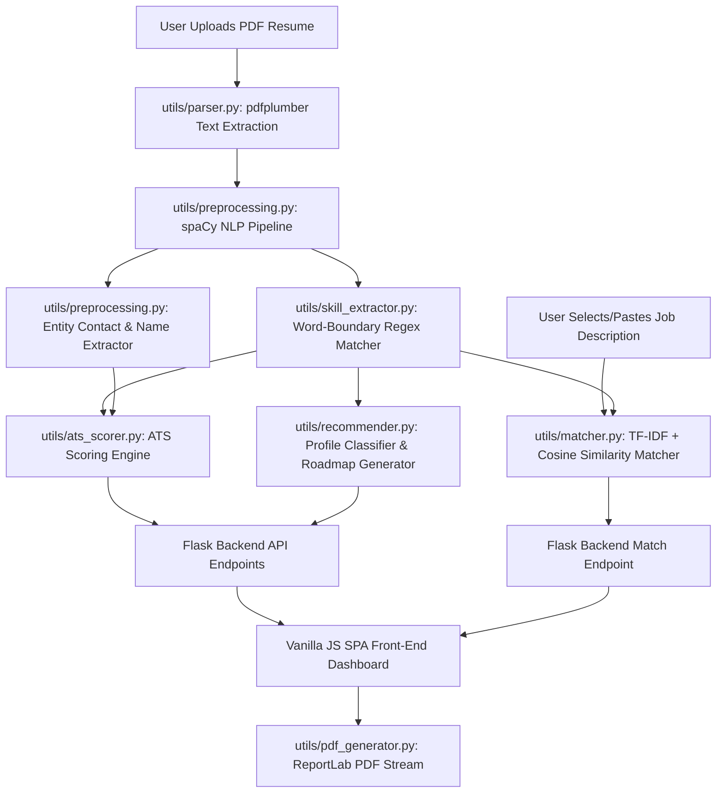

# 💼 ResumeIQX: AI-Powered Resume Analyzer & Career Recommender

[](https://www.python.org/)
[](https://flask.palletsprojects.com/)
[](https://spacy.io/)
[](https://scikit-learn.org/)
[](https://www.reportlab.com/)

A production-grade, highly aesthetic **AI-Powered Resume Analyzer and Career Recommendation System** designed to elevate placement readiness. Built with **Flask**, **spaCy**, and **Scikit-Learn**, this application performs deep semantic parsing, scores resumes against strict ATS parameters, predicts career pathways, and maps skill gaps with curated learning roadmaps.

---

## 📸 System Data Flow & Architecture

The diagram below details how the resume parsing, NLP extraction, matching, and recommendation engines interact:



---

## 🚀 Core Features

### 1. 📄 ATS Resume Scorer & Analyzer
* **Automated Text Extraction:** Uses `pdfplumber` to extract and clean text from uploaded PDF resumes (gracefully handling ligature characters, tabular columns, and line brakes).
* **Fresher/Student Optimization Toggle:** Adjusts the scoring logic dynamically, allowing personal or academic projects to substitute for industry work experience to score junior applicants fairly.
* **Multi-Factor Scoring (Out of 100):** Measures resume strength across four critical pillars:
  1. *Section Completeness (30%):* Detects crucial sections (Education, Experience, Skills, Projects, Contact Details).
  2. *Skill Density (30%):* Checks if listed technologies fall within the optimal industry range (12-22 skills).
  3. *Word Count / Length (20%):* Analyzes length and penalizes overly wordy (under 600 words for freshers) or critically short resumes.
  4. *Formatting & Action Verbs (20%):* Evaluates use of strong action verbs (e.g., *engineered, optimized, automated, refactored*) and checks for clickable contact links (LinkedIn, GitHub).
* **Actionable Recommendations:** Generates dynamic, context-aware suggestions detailing exactly why deductions occurred and how to fix them.

### 2. 🎯 Semantic Job Description Matcher
* **TF-IDF Vectorization:** Transforms resume and target job descriptions into a vector space of word importance scores.
* **Hybrid Match Scorer:** Combines cosine similarity (50%) and physical skill token coverage (50%) to prevent false-positive matching on filler words while maintaining deep semantic relevance.
* **Gap Analysis & Badges:** Categorizes job keywords into *Matching Skills Possessed* (green) and *Missing Skills (Skill Gap)* (red) for instant visualization.

### 3. 💼 Intelligent Career Planner & Skill Gap Roadmaps
* **Category Prediction:** Predicts the primary resume profile (e.g., *Backend Development*, *Data Science & AI*, *DevOps & Cloud*, etc.) based on parsed skill concentrations.
* **Market Insights:** Displays estimated salaries, growth trends (e.g., *+35% Exponential Growth*), and high-demand skills for matched career tracks.
* **Interactive Roadmaps:** For every missing career skill, the engine suggests curated next-steps, recommended courses, and topics to study.

### 4. 📂 Reference Skill Taxonomy Browser
* Displays all 200+ technology keywords tracked by the custom Regex engine, divided into 8 distinct technical folders (Programming Languages, Web Development, Databases, Cloud & DevOps, AI/ML, Mobile & Systems, Software Engineering Concepts, and Soft Skills).

### 5. 📥 Professional PDF Report Export
* Generates and downloads a beautifully styled, print-ready PDF analysis report using **ReportLab** containing the full compatibility scorecard, actionable items, and career roadmap highlights.

---

## 📂 Project Architecture

```
AI_Resume_Project/
│
├── app.py                      # Flask main server (routing, middleware, APIs)
├── requirements.txt            # Python dependencies
├── README.md                   # Installation & documentation (This file)
│
├── templates/
│   └── index.html              # Custom HTML5 dashboard landing layout (Inter & Outfit fonts)
│
├── static/
│   ├── css/
│   │   └── styles.css          # Sleek glassmorphism stylesheets
│   └── js/
│       └── main.js             # Client SPA controller, fetch requests, & gauge logic
│
├── data/
│   └── sample_jds.json         # Predefined high-quality Job Descriptions for testing
│
└── utils/
    ├── parser.py               # Extract text and page count from PDF resumes
    ├── preprocessing.py        # Tokenization, cleaning, and regex contact/name parsing
    ├── skill_extractor.py      # Skill taxonomies & custom Regex-based matchers
    ├── ats_scorer.py           # ATS scoring calculations, action verbs, and thresholds
    ├── matcher.py              # TF-IDF + Cosine Similarity matching engine
    ├── recommender.py          # Career mapping, skill gap analysis, and course paths
    ├── pdf_generator.py        # ReportLab PDF print-out layout manager
    └── visualizer.py           # [Legacy] Streamlit dashboard visualization utilities
```

---

## 🛠️ Installation & Setup

Follow these steps to run the application locally on your computer:

### Prerequisites
Make sure you have **Python 3.8+** installed.

### 1. Navigate to the Project Directory
Open your terminal and navigate to the project workspace:
```bash
cd c:/Users/paras/OneDrive/Documents/AI_Resume_Project
```

### 2. Install Dependencies
Install all required libraries using `pip`:
```bash
pip install -r requirements.txt
```
*(Note: The application will automatically download the spaCy `en_core_web_sm` model on first launch. If you face any issues, you can run `python -m spacy download en_core_web_sm` manually).*

### 3. Launch the Flask Server
Start the local server:
```bash
python app.py
```

### 4. Open in Browser
Once launched, open your web browser and navigate to:
```
http://127.0.0.1:5000
```

---

## 🚀 How to Test the System

1. **Step 1: Get Scored**
   - Navigate to the **ATS Scorecard** tab.
   - Toggle the **Student / Fresher** option if you are a student or fresh graduate.
   - Upload any sample tech resume (in `.pdf` format) inside the upload box.
   - Click **Analyze Uploaded Resume**.
   - Review your overall compatibility gauge, extracted contact information, and skill distribution folders.
   - Click **Export Detailed PDF Report** to download a print-ready PDF scorecard.

2. **Step 2: Match against a Job Description (JD)**
   - Navigate to the **Job Matcher Portal** tab.
   - Select one of the pre-loaded jobs from the dropdown (e.g. *DeepMinded AI Labs - AI/ML Engineer* or *TechNova Solutions - Backend Software Engineer*).
   - Alternatively, paste any job description from LinkedIn, Indeed, or elsewhere.
   - Click **Run Compatibility Comparison** to view matching/missing badges and semantic similarity metrics.

3. **Step 3: Roadmap Upskilling**
   - Go to the **Career Roadmap** tab.
   - Check your primary predicted category.
   - Expand the recommended careers to view tailored roadmap milestones and links to master missing skills.

---

## 🧑‍💻 Technical Highlights (For Portfolio/Resume)

* **Hybrid Matcher Architecture:** Developed a specialized scoring metric combining structural text representation (TF-IDF bag-of-words vectorization) with discrete set theory logic (Hard Skill token intersection ratio).
* **Word-Boundary Symbol Parser:** Crafted case-insensitive Regular Expressions to accurately detect specialized programming syntax (`C++`, `C#`, `.NET`, `Node.js`) while maintaining strict word boundary safety to eliminate substring collisions and bullet indexing errors.
* **Client-Side SPA Architecture:** Implemented a central client-side state object (`const state = {...}`) in vanilla JavaScript, ensuring parsed resume metadata, matched job results, and navigation tab views persist seamlessly without full-page reloads.
* **Dynamic PDF Streaming:** Configured an on-the-fly binary buffer using `io.BytesIO` and `ReportLab`'s `SimpleDocTemplate` to compile and stream custom-branded PDF scorecards directly to client browsers without saving files to server disks.
